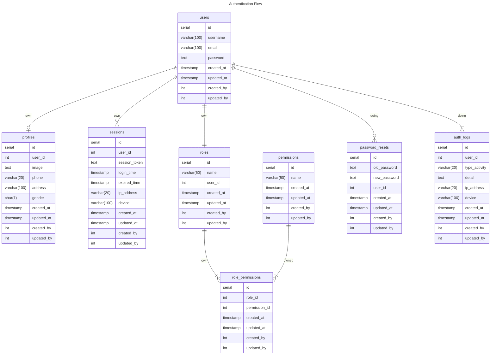

# ERD Aunthentication Flow

```mermaid
---
    title: Authentication Flow
---
erDiagram
    users {
        serial id
        varchar(100) username
        varchar(100) email
        text password
        timestamp created_at
        timestamp updated_at
        int created_by
        int updated_by
    }

    profiles {
        serial id
        int user_id
        text image
        varchar(20) phone
        varchar(100) address
        char(1) gender
        timestamp created_at
        timestamp updated_at
        int created_by
        int updated_by
    }

    users ||--o| profiles : own

    sessions {
        serial id
        int user_id
        text session_token
        timestamp login_time
        timestamp expired_time
        varchar(20) ip_address
        varchar(100) device
        timestamp created_at
        timestamp updated_at
        int created_by
        int updated_by
    }

    users ||--o{ sessions : own

    roles {
        serial id
        varchar(50) name
        int user_id
        timestamp created_at
        timestamp updated_at
        int created_by
        int updated_by
    }

    users ||--|| roles : own

    permissions {
        serial id
        varchar(50) name
        timestamp created_at
        timestamp updated_at
        int created_by
        int updated_by
    }

    role_permissions {
        serial id
        int role_id
        int permission_id
        timestamp created_at
        timestamp updated_at
        int created_by
        int updated_by
    }

    roles ||--|{ role_permissions : own
    permissions ||--|{ role_permissions : owned

    password_resets {
        serial id
        text old_password
        text new_password
        int user_id
        timestamp created_at
        timestamp updated_at
        int created_by
        int updated_by
    }

    users ||--o{ password_resets : doing

    auth_logs {
        serial id
        int user_id
        varchar(20) type_activity
        text detail
        varchar(20) ip_address
        varchar(100) device
        timestamp created_at
        timestamp updated_at
        int created_by
        int updated_by
    }

    users ||--|{ auth_logs : doing
```
